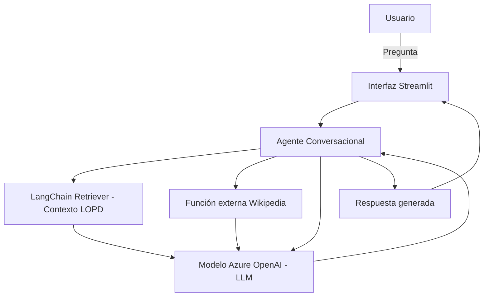

# Agente Conversacional con Function Calling y RAG (Retrieval-Augmented Generation) usando Azure OpenAI

Este proyecto implementa un sistema agéntico funcional que integra:

- **Function Calling** con Azure OpenAI: permite que el modelo invoque funciones externas según el tipo de pregunta.
- **RAG (Retrieval-Augmented Generation)**: recuperación de contexto desde un documento local usando embeddings y LangChain.
- **Fuente externa (Wikipedia)**: para preguntas sobre temas actuales o fuera del contexto local.
- **Interfaz gráfica (Streamlit)**: facilita la interacción con el agente desde el navegador.

## Objetivo del proyecto

Este proyecto es parte del curso de sistemas agénticos y demuestra cómo construir un agente conversacional inteligente usando técnicas avanzadas de LLM, incluyendo:

- Llamadas a funciones personalizadas.
- Indexado y búsqueda semántica de documentos con embeddings.
- Recuperación y generación de respuestas enriquecidas con LangChain y Wikipedia.
- Frontend funcional con Streamlit.
- Despliegue y configuración usando Azure OpenAI.

---

## Diagrama de Arquitectura



---

## Requisitos del sistema

- Python 3.9 o superior
- Cuenta activa en Azure con acceso a Azure OpenAI
- Acceso a internet
- Clave API y endpoint configurados

---

## Archivos del proyecto

```
├── data/
│   └── contexto.txt           # Documento fuente indexado para el RAG (normativa LOPD)
├── main.py                    # Motor principal del agente (CLI)
├── app.py                     # Interfaz Streamlit
├── requirements.txt           # Dependencias Python
├── .env.example               # Variables de entorno (config Azure)
└── README.md                  # Este archivo
```

---

## Configuración

1. Clona el repositorio y accede al directorio:
```bash
git clone https://github.com/JessicaGV28/agente-rag-azure.git
cd agente-rag-azure
```

2. Copia el archivo `.env.example` a `.env` y completa tus credenciales de Azure:

```env
AZURE_DEPLOYMENT_NAME=nombre_deployment
AZURE_OPENAI_API_KEY=tu_api_key
AZURE_OPENAI_ENDPOINT=https://tu_endpoint.openai.azure.com/
AZURE_OPENAI_API_VERSION=2023-05-15
```

3. Asegúrate de tener el archivo `data/contexto.txt` con el contenido base del agente (normativa LOPD).

---

## Instalación de dependencias

```bash
pip install -r requirements.txt
```

---

## Cómo ejecutar

### Desde consola (modo texto)

```bash
python main.py
```

### Desde navegador (modo gráfico)

```bash
streamlit run app.py
```

Accede a [http://localhost:8501](http://localhost:8501) para usar la app.

---

## Funcionamiento del agente

1. Recibe una pregunta del usuario.
2. Busca información relevante en el documento local usando embeddings y LangChain.
3. Si detecta una necesidad de información actualizada o externa, consulta Wikipedia.
4. Combina la información recuperada y responde manteniendo memoria conversacional.

---

## Notas adicionales

- La recuperación desde Wikipedia se realiza mediante la librería `wikipediaapi`.
- La memoria del agente se mantiene durante cada sesión de ejecución.
- La detección de cuándo usar Wikipedia está basada en palabras clave predefinidas como “último”, fechas recientes, etc.

---

## Licencia

MIT License

---

## Enlace al repositorio

[https://github.com/JessicaGV28/agente-rag-azure]
