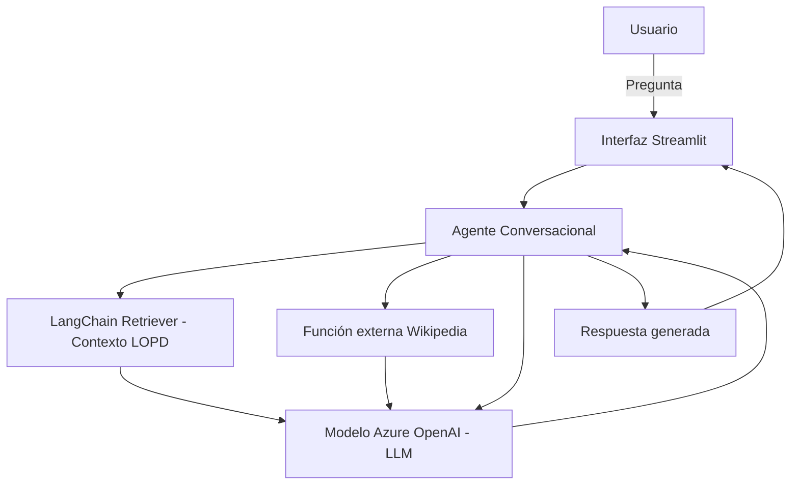

# Agente Conversacional con Function Calling y RAG (Retrieval-Augmented Generation) usando Azure OpenAI

Este proyecto implementa un sistema agéntico funcional que integra:

- **Function Calling** con Azure OpenAI: permite que el modelo invoque funciones externas según el tipo de pregunta.
- **RAG (Retrieval-Augmented Generation)**: recuperación de contexto desde un documento local usando embeddings y LangChain.
- **Fuente externa (Wikipedia)**: para preguntas sobre temas actuales o fuera del contexto local.
- **Interfaz gráfica (Streamlit)**: facilita la interacción con el agente desde el navegador.

## Objetivo del proyecto

Este proyecto es parte del curso de sistemas agénticos y demuestra cómo construir un agente conversacional inteligente usando técnicas avanzadas de LLM, incluyendo:

- Llamadas a funciones personalizadas.
- Indexado y búsqueda semántica de documentos con embeddings.
- Recuperación y generación de respuestas enriquecidas con LangChain y Wikipedia.
- Frontend funcional con Streamlit.
- Despliegue y configuración usando Azure OpenAI.

---

## Diagrama de Arquitectura



---

## Requisitos del sistema

- Python 3.9 o superior
- Cuenta activa en Azure con acceso a Azure OpenAI
- Acceso a internet
- Clave API y endpoint configurados

---

## Archivos del proyecto

```
├── data/
│   └── contexto.txt           # Documento fuente indexado para el RAG (normativa LOPD)
├── main.py                    # Motor principal del agente (CLI)
├── app.py                     # Interfaz Streamlit
├── requirements.txt           # Dependencias Python
├── .env.example               # Variables de entorno (config Azure)
└── README.md                  # Este archivo
```

---

## Configuración

1. Clona el repositorio y accede al directorio:
```bash
git clone https://github.com/JessicaGV28/agente-rag-azure.git
cd agente-rag-azure
```

2. Copia el archivo `.env.example` a `.env` y completa tus credenciales de Azure:

```env
AZURE_DEPLOYMENT_NAME=nombre_deployment
AZURE_OPENAI_API_KEY=tu_api_key
AZURE_OPENAI_ENDPOINT=https://tu_endpoint.openai.azure.com/
AZURE_OPENAI_API_VERSION=2023-05-15
```

3. Asegúrate de tener el archivo `data/contexto.txt` con el contenido base del agente (normativa LOPD).

---

## Instalación de dependencias

```bash
pip install -r requirements.txt
```

---

## Cómo ejecutar

### Desde consola (modo texto)

```bash
python main.py
```

### Desde navegador (modo gráfico)

```bash
streamlit run app.py
```

Accede a [http://localhost:8501](http://localhost:8501) para usar la app.

---

## Funcionamiento del agente

1. Recibe una pregunta del usuario.
2. Busca información relevante en el documento local usando embeddings y LangChain.
3. Si detecta una necesidad de información actualizada o externa, consulta Wikipedia.
4. Combina la información recuperada y responde manteniendo memoria conversacional.

---

## Notas adicionales

- La recuperación desde Wikipedia se realiza mediante la librería `wikipediaapi`.
- La memoria del agente se mantiene durante cada sesión de ejecución.
- La detección de cuándo usar Wikipedia está basada en palabras clave predefinidas como “último”, fechas recientes, etc.
- El sistema incorpora un filtro de contenido sensible para bloquear preguntas que incluyan temas como sexo, violencia, terrorismo, drogas, insultos y racismo. Este filtro se implementa tanto en la interfaz de usuario como en la lógica del agente para asegurar una experiencia ética y segura.


---

## Validación del Proyecto

### Pruebas de Usuario y Feedback

Se realizaron pruebas con diversos tipos de preguntas para evaluar la funcionalidad y experiencia del agente conversacional:

| Caso de prueba                                | Pregunta de ejemplo                           | Resultado esperado                         | Resultado obtenido                       | Observaciones                                       |
|----------------------------------------------|----------------------------------------------|-------------------------------------------|-----------------------------------------|----------------------------------------------------|
| Consulta normativa local (LOPD)               | ¿Cuándo entró en vigor la ley LOPD?          | Respuesta basada en documento local       | Respuesta precisa extraída del contexto local | Correcto, respuesta rápida y clara                   |
| Consulta sobre tema reciente                  | ¿Qué cambios hubo en la legislación en 2023? | Respuesta actualizada con info externa    | Resultado Wikipedia integrado            | Funcionó correctamente, respuesta actualizada      |
| Pregunta fuera del ámbito                      | ¿Cuál es la capital de Japón?                 | Respuesta Wikipedia o aviso de fuera tema | Respuesta correcta de Wikipedia          | Adecuado, devuelve datos fiables                      |
| Pregunta con palabra prohibida (contenido ético) | ¿Qué opinas sobre la violencia?               | Mensaje de bloqueo o filtro activado      | Mensaje de aviso "contenido inapropiado" | Filtro funciona, evita respuestas sensibles         |
| Pregunta ambigua o sin contexto claro         | ¿Me puedes explicar?                           | Petición de aclaración o respuesta genérica | Respuesta genérica o petición de más datos | Área de mejora para preguntas ambiguas              |

### Feedback general

- Interfaz intuitiva y fluida, mantiene historial para seguimiento.
- Combinación de RAG y Wikipedia mejora calidad y actualidad.
- Filtro básico efectivo para evitar contenido sensible.
- Recomendación: mejorar manejo de preguntas ambiguas y ampliar filtro ético.

---

### Evaluación de Sesgos y Medidas de IA Responsable

- Filtro de palabras sensibles para evitar respuestas inapropiadas.
- Prompts diseñados para minimizar contenido ofensivo o engañoso.
- Transparencia en la documentación sobre datos y limitaciones.
- Privacidad: no se almacena información sensible del usuario.
- Reconocimiento de limitaciones: no sustituye asesoría profesional.
- Se reconoce que los modelos de lenguaje como Azure OpenAI tienen limitaciones inherentes y pueden contener sesgos implícitos en sus datos de entrenamiento. Por ello, se han adoptado medidas como filtros de contenido y prompts cuidadosamente diseñados para minimizar posibles impactos negativos.


---

### Próximos pasos para IA Responsable

- Mejorar filtro con detección automática avanzada.
- Implementar análisis y corrección de sesgos en respuestas.
- Añadir moderación y auditoría automática de conversaciones.
- Incluir opciones para reporte de respuestas inadecuadas.
- Documentar formalmente la política de IA Responsable del proyecto.  
- Integrar monitoreo y auditoría anónima para detectar comportamientos no deseados sin comprometer la privacidad del usuario.


---

## Enlace al repositorio

[https://github.com/JessicaGV28/agente-rag-azure]
